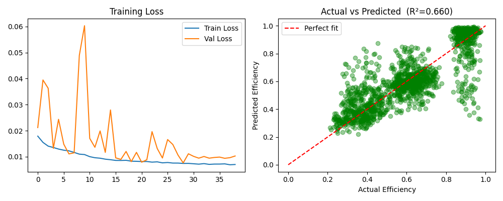

# Photosynthesis Efficiency Prediction using Deep Learning

## Project Overview
This project predicts photosynthesis efficiency using a Deep Learning model built with TensorFlow/Keras.

## Features
- Data preprocessing
- Model training
- Efficiency prediction
- Training loss visualization
- Actual vs Predicted analysis

## Technologies Used
- Python
- TensorFlow/Keras
- NumPy
- Pandas
- Matplotlib
- Scikit-Learn

## Project Structure

```text
majorproject/
├── app.py
├── train.py
├── predict.py
├── utils.py
├── final_model.h5
├── training_graph.png
├── prediction_graph.png
```

## Results

### Training Loss


### Prediction Results


## Author
Kanak Lilhare